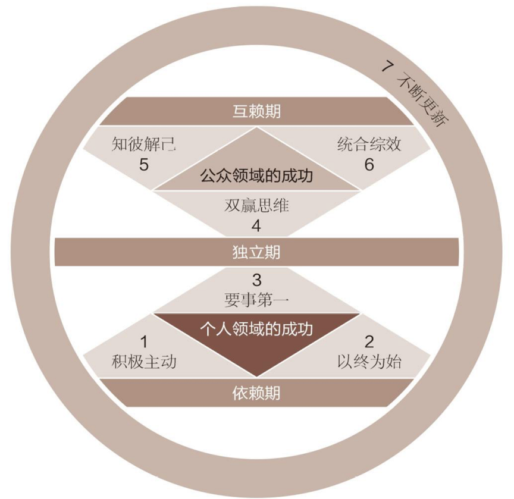

## 高效能人士七个习惯

**习惯一：积极主动（BE PROACTIVE）**

主动积极即采取主动，为自己过去、现在及未来的行为负责，并依据原则及价值观，而非情绪或外在环境来下决定。主动积极的人是改变的催生者，他们扬弃被动的受害者角色，不怨怼别人，发挥了人类四项独特的禀赋——自觉、良知、想像力和自主意志，同时以由内而外的方式来创造改变，积极面对一切。他们选择创造自己的生命这也是每个人最基本的决定。

**习惯二：以终为始（BEGIN WITH THE END IN MIND）**

所有事物都经过两次的创造——先是在脑海里酝酿，其次才是实质的创造。个人、家庭、团队和组织在做任何计划时，均先拟出愿景和目标，并据此塑造未来，全心投注于自己最重视的原则、价值观、关系及目标之上。对个人、家庭或组织而言，使命宣言可说是愿景的最高形式，它是主要的决策，主宰了所有其他的决定。领导工作的核心，就是在共有的使命、愿景和价值观之后，创造出一个文化。

**习惯三：要事第一（PUT FIRST THINGS FIRST）**

要事第一即实质的创造，是梦想（你的目标、愿景、价值观及要事处理顺序）的组织与实践。次要的事不必摆在第一，要事也不能放在第二。无论迫切性如何，个人与组织均针对要事而来，重点是，把要事放在第一位。

**习惯四：双赢思维（THINK WIN/WIN）**

双赢思维是一种基于互敬，寻求互惠的思考框架与心意，目的是更丰盛的机会、财富及资源，而非敌对式竞争。双赢即非损人利己（赢输），亦非损己利人（输赢）。我们的工作伙伴及家庭成员要从互赖式的角度来思考（“我们”，而非“我”）。双赢思维鼓励我们解决问题，并协助个人找到互惠的解决办法，是一种资讯、力量、认可及报酬的分享。

**习惯五：知彼解己（SEEK FIRST TO UNDERSTAND，THEN TO BE UNDERSTOOD）**

当我们舍弃回答心，改以了解心去聆听别人，便能开启真正的沟通，增进彼此关系。对方获得了解后，会觉得受到尊重与认可，进而卸下心防，坦然而谈，双方对彼此的了解也就更流畅自然。知彼需要仁慈心；解己需要勇气，能平衡两者，则可大幅提升沟通的效率。

**习惯六：统合综效（SYNERGIZE）**

统合综效谈的是创造第三种选择——即非按照我的方式，亦非遵循你的方式，而是第三种远胜过个人之见的办法。它是互相尊重的成果——不但是了解彼此，甚至是称许彼此的差异，欣赏对方解决问题及掌握机会的手法。个人的力量是团队和家庭统合综效的利基，能使整体获得一加一大于二的成效。实践统合综效的人际关系和团队会扬弃敌对的态度（1＋1＝1/2)），不以妥协为目标（1＋1＝2)），也不仅止于合作（1＋1＝2），他们要的是创造式的合作（1＋1＞2）。

**习惯七：不断更新（SHARPEN THE SAW）**

“不断更新”谈的是，如何在四个基本生活面向（身体、精神、智力、社会／情感）中，不断更新自己。这个习惯提升了其他六个习惯的实施效率。对组织而言，习惯七提供了愿景、更新及不断的改善，使组织不至呈现老化及疲态，并迈向新的成长之径。对家庭而言，习惯七透过固定的个人及家庭活动，使家庭效能升级，就像建立传统，使家庭日新月异，即是一例。