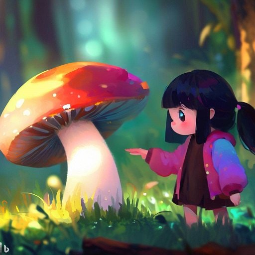

## 采蘑菇的小姑娘


采蘑菇的小姑娘

- 故事开头：介绍若水的生活环境和性格特点，她是一个勇敢、聪明、善良的小女孩，她的父母都去世了，她只能靠采蘑菇为生，她住在一个小木屋里，每天早上都会去森林里寻找蘑菇。
- 故事发展：有一天，若水在森林里发现了一个奇怪的蘑菇，它有七彩的斑点，闪闪发光，若水好奇地摘下了它，突然，她感觉自己被吸进了一个漩涡，当她清醒过来时，她发现自己来到了一个童话的世界。在这个世界里，她遇到了一只会说话的兔子、一只会飞的狮子、一只会唱歌的鸟、一只会变形的猫和一只会施法的狐狸。他们告诉若水，这个世界叫做梦幻之地，是由魔法蘑菇创造的，每个人都可以实现自己的愿望。但是，这个世界也有一个危险的敌人，那就是邪恶怪兽。邪恶怪兽想要吞噬所有的魔法蘑菇，让梦幻之地变成黑暗之地。他们说若水是被魔法蘑菇选中的人，她有着拯救梦幻之地的使命。
- 故事高潮：若水和她的新朋友们决定一起对抗邪恶怪兽，他们利用各自的特长和魔法蘑菇的力量，与邪恶怪兽展开了一场激烈的战斗。在战斗中，若水表现出了无畏和智慧，她用魔法蘑菇制造了一个巨大的火球，将邪恶怪兽烧成了灰烬。
- 故事结尾：若水和她的朋友们成功地拯救了梦幻之地，所有的生灵都为他们欢呼和感谢。魔法蘑菇告诉若水，她可以选择留在梦幻之地或者回到人类世界。若水想了想，决定回到人类世界，因为她还有很多未完成的梦想。魔法蘑菇说它会永远陪伴若水，并给她留下了一个秘密通道，让她可以随时回到梦幻之地。若水感动地拥抱了魔法蘑菇和她的朋友们，然后回到了人类世界。她发现自己还拿着那个七彩斑点的蘑菇，她把它种在了自己的花园里，希望它能长出更多的魔法蘑菇。




第一章

若水是一个孤儿，她的父母在她很小的时候就去世了，她只能靠自己生活。她住在一个小木屋里，每天早上都会去森林里寻找蘑菇，然后拿到村里去卖。她的生活虽然艰苦，但是她从不抱怨，她总是乐观、勇敢、聪明、善良。

有一天，若水像往常一样起了个大早，背着一个篮子，走进了森林。她喜欢森林，她觉得森林里有很多奇妙的东西，比如美丽的花朵、可爱的小动物、神秘的声音。她常常会在森林里探索和发现，有时候还会和小动物们玩耍。

今天，若水走了很久，却没有找到一颗蘑菇。她感到有些失望，但是她没有放弃，她继续向前走。突然，她看到了一束光芒，从树林的深处透过来。若水好奇地朝光芒的方向走去，她想知道那里有什么。

当若水走近光芒的地方时，她惊讶地发现了一个奇怪的蘑菇。这个蘑菇有七彩的斑点，闪闪发光，就像一个宝石一样。若水从来没有见过这样的蘑菇，她觉得它非常美丽，也非常珍贵。她忍不住伸出手去摘下它。

就在若水摘下蘑菇的那一刻，她感觉自己被吸进了一个漩涡，周围的一切都变得模糊不清。她想要大叫，但是却发不出声音。她感到一阵眩晕，然后失去了意识。


第二章

当若水清醒过来时，她发现自己来到了一个童话的世界。她看到了一片蓝色的草地，上面开满了各种颜色的花朵。她看到了一条清澈的小溪，里面有许多五彩斑斓的鱼儿。她看到了一座白色的城堡，上面有金色的尖塔和彩色的旗帜。她看到了一片彩虹，下面有一锅金币和一只独角兽。

若水觉得自己像是在做梦，她不敢相信自己的眼睛。她想要掐一下自己，看看是不是真的。就在这时，她听到了一个声音。

“嘿，你好啊，小姑娘。”声音说。

若水顺着声音的方向看去，她看到了一只兔子。这只兔子不同于普通的兔子，它有着白色的毛皮，红色的眼睛，还戴着一顶黑色的礼帽和一副金色的眼镜。最让若水惊讶的是，这只兔子会说话。

“你是谁？你在哪里？”若水问道。

“我叫阿布，我是这里的向导。我是魔法蘑菇派来接你的。”兔子说。

“魔法蘑菇？什么魔法蘑菇？”若水问道。

“就是你刚才摘下来的那个蘑菇啊。它是这个世界的创造者和守护者。它把你带到了这里，因为它认为你是一个特别的人。”兔子说。

“特别的人？我有什么特别的？”若水问道。

“你有着纯真和善良的心灵，你有着无限的想象力和创造力，你有着勇气和智慧。你是被魔法蘑菇选中的人，你有着拯救这个世界的使命。”兔子说。

“拯救这个世界？什么意思？”若水问道。

“这个世界叫做梦幻之地，它是由魔法蘑菇创造出来的一个美好而神奇的地方。在这里，每个人都可以实现自己的愿望，每个人都可以找到自己的快乐。但是，这个世界也有一个危险的敌人，那就是邪恶怪兽。”兔子说。

邪恶怪兽是一个长着黑色的鳞片，红色的眼睛，尖尖的牙齿，绿色的爪子的巨大的怪物。它有着强大的力量和速度，还能吐出毒液和火焰。它是梦幻之地的最大的威胁，它想要吞噬所有的魔法蘑菇，让梦幻之地变成黑暗之地。”兔子说。

“它为什么要这样做？它有没有什么理由？”若水问道。

“它没有什么理由，它只是一个充满了恶意和贪婪的生物。它想要破坏一切美好的东西，它想要让所有的生灵都陷入绝望和恐惧。它想要吞噬魔法蘑菇，是因为魔法蘑菇是梦幻之地的源泉，只要有了魔法蘑菇，它就可以控制这个世界。”兔子说。

“那它有没有什么弱点？我们怎么才能阻止它？”若水问道。

“它的弱点是光明和爱。它最怕的是阳光和彩虹，因为它们代表了希望和美丽。它最讨厌的是友情和勇气，因为它们代表了力量和信念。我们要阻止它，就要用我们的心灵和魔法来对抗它。”兔子说。

“我们的心灵和魔法？我们有吗？”若水问道。

“当然有啊，你不觉得吗？你不觉得你的心里有一种温暖和光明的感觉吗？你不觉得你的手里拿着一种神奇和强大的东西吗？”兔子说。

若水低头看了看自己的手，她发现她还拿着那个七彩斑点的蘑菇，她感到了一阵温暖，就像有一个声音在她的心里说：“不要害怕，不要担心，我会一直陪伴你，我会一直保护你。你是一个特别的人，你有着特别的使命。你要相信自己，相信你的朋友，相信你的魔法。你可以做到的，你一定可以做到的。”

若水听到了这个声音，她觉得自己的心里充满了勇气和信心。她抬起了头，看着兔子，微笑着说：“好吧，我相信你，我相信魔法蘑菇，我也相信自己。那么，我们现在该怎么做呢？”

兔子也微笑着说：“很好，很好，你是一个了不起的小女孩。我们现在该去找其他的朋友，他们也是被魔法蘑菇选中的人，他们也有着各自的魔法和特长。只有我们团结一致，才能战胜邪恶怪兽。”

“其他的朋友？他们是谁？他们在哪里？”若水问道。

“他们是一只会飞的狮子、一只会唱歌的鸟、一只会变形的猫和一只会施法的狐狸。他们分别住在梦幻之地的四个方向：东、南、西、北。我们要去找他们，让他们加入我们的队伍。”兔子说。

“好吧，那我们从哪个方向开始呢？”若水问道。

“我们先从东边开始吧，那里有一片美丽的花园，那里住着会飞的狮子。”兔子说。

“好的，那我们走吧。”若水说。

于是，若水和兔子开始了他们的冒险之旅。他们带着魔法蘑菇和满满的期待，向着梦幻之地的东方出发了。


第三章

若水和兔子走了一会儿，就来到了一片美丽的花园。花园里有各种各样的花朵，有红色的玫瑰，有黄色的向日葵，有紫色的薰衣草，还有许多若水从来没有见过的奇异的花卉。花园里还有许多蝴蝶、蜜蜂、鸟儿等小动物，他们在花丛中飞舞、采蜜、歌唱，形成了一幅和谐而美丽的画面。

若水被花园里的景色所吸引，她忍不住想要走进去，闻一闻花香，摘一朵花儿。兔子却拉住了她的手，说：“不要乱动，这里可不是一个安全的地方。这里是会飞的狮子的领地，他可不喜欢别人打扰他。”

“会飞的狮子？他是什么样子的？”若水问道。

“他是一个金色的狮子，他有着一对白色的翅膀，他可以在空中自由地飞翔。他是一个高傲而自私的家伙，他认为自己是这个世界上最强大和最美丽的生物。他不喜欢和别人交朋友，也不喜欢帮助别人。他只关心自己的快乐和利益。”兔子说。

“那我们怎么才能让他加入我们呢？”若水问道。

“我们要用我们的智慧和魅力来说服他。我们要让他看到我们的诚意和价值，我们要让他感受到我们的友情和勇气。我们要让他明白，只有和我们一起，才能保护这个世界和自己。”兔子说。

“好吧，那我们怎么才能找到他呢？”若水问道。

“我们要用我们的声音来吸引他。我们要用我们最美丽和最动听的歌声来唱出我们的心声。我们要用我们最真诚和最感人的歌词来表达我们的愿望。我们要用我们最热情和最激昂的歌调来激发他的兴趣。”兔子说。

“好吧，那你会唱歌吗？”若水问道。

“当然会啊，我是一个很会唱歌的兔子。你也会唱歌吗？”兔子问道。

“我也会一点点。”若水说。

“那就好，那就让我们一起唱一首歌吧。”兔子说。


好的，那我们一起开始吧。

```
我们来自不同的世界
我们有着不同的梦想
我们想要寻找一个奇迹
我们想要创造一个传奇

我们需要你的帮助
我们需要你的力量
我们需要你的魔法
我们需要你的翅膀

请你听听我们的歌声
请你看看我们的眼神
请你感受我们的心情
请你相信我们的诚意

请你加入我们的队伍
请你和我们一起飞翔
请你和我们一起战斗
请你和我们一起拯救这个世界


```

希望会飞的狮子能听到我们的歌声，能被我们的歌声打动。


第四章

若水和兔子开始唱起了他们的歌，他们的歌声清亮而动听，传遍了整个花园。他们的歌词真诚而感人，表达了他们的愿望和诚意。他们的歌调热情而激昂，激发了他们的勇气和信心。

他们唱着，唱着，不知不觉地走到了花园的中心。在那里，有一棵巨大的玫瑰花树，它的花朵有着各种各样的颜色，有红色的、黄色的、紫色的、白色的、粉色的，还有一些若水从来没有见过的颜色。花树上还挂着许多闪亮的珠子和彩带，就像是一个节日一样。

若水和兔子被花树的美丽所吸引，他们停下了歌声，走近了花树。就在这时，他们听到了一个声音。

“谁在唱歌？谁在打扰我？”声音说。

若水和兔子顺着声音的方向看去，他们看到了一个金色的狮子。这个狮子有着一对白色的翅膀，他正躺在花树上，慵懒地打着哈欠。他看起来很高傲而自私，他没有把若水和兔子放在眼里。

“你就是会飞的狮子吗？”若水问道。

“是啊，我就是会飞的狮子。你们是谁？你们为什么来打扰我？”狮子问道。

“我们是来自另一个世界的旅行者。我们是被魔法蘑菇选中的人。我们有着拯救这个世界的使命。”兔子说。

“魔法蘑菇？拯救这个世界？你们在说什么？你们在胡说八道。”狮子说。

“我们没有胡说八道，我们说的都是真话。这个世界叫做梦幻之地，它是由魔法蘑菇创造出来的一个美好而神奇的地方。但是，这个世界也有一个危险的敌人，那就是邪恶怪兽。邪恶怪兽是一个长着黑色的鳞片，红色的眼睛，尖尖的牙齿，绿色的爪子的巨大的怪物。它想要吞噬所有的魔法蘑菇，让梦幻之地变成黑暗之地。我们要阻止它，就要用我们的心灵和魔法来对抗它。”兔子说。

“你们说的都是些什么胡话？我从来没有听说过什么邪恶怪兽，也没有看到过什么魔法蘑菇。这个世界是我的世界，我是这个世界的王者。我不需要你们的帮助，也不需要你们的魔法。你们赶快离开吧，不要再打扰我。”狮子说。

“你错了，你错了，你太自私了。这个世界不是你一个人的世界，这个世界是所有生灵共同的家园。你不应该只关心自己，你应该关心别人。你不应该只享受自己，你应该分享给别人。你不应该只飞翔自己，你应该和别人一起飞翔。”若水说。

“你说什么？你敢教训我？你知道我是谁吗？我是会飞的狮子，我是这个世界上最强大和最美丽的生物。你们这些小不点，不配和我说话，更不配和我做朋友。你们赶快滚吧，不然我会让你们后悔。”狮子说。

说完，狮子张开了他的翅膀，准备飞走。若水和兔子却没有放弃，他们决定用他们最后的办法来说服狮子。

他们再次唱起了他们的歌，他们的歌声更加清亮而动听，他们的歌词更加真诚而感人，他们的歌调更加热情而激昂。他们用他们的歌声表达了他们的心声，他们用他们的歌声打动了狮子。

狮子听到了他们的歌声，他感到了一种从未有过的感觉。他感到了一种温暖和光明的感觉，就像有一个声音在他的心里说：“不要孤独，不要冷漠，你不是一个人，你有着朋友和伙伴。你不是一个王者，你是一个英雄。你要相信别人，相信自己，相信魔法。你可以做到的，你一定可以做到的。”

狮子听到了这个声音，他觉得自己的心里充满了柔软和温情。他停下了飞行，落在了花树上，看着若水和兔子，微笑着说：“你们说得对，你们说得对，我错了。我太自私了，我太傲慢了。我应该和你们一起，我应该和你们一起拯救这个世界。”

若水和兔子听到了狮子的话，他们感到了无比的欣喜和惊喜。他们跑到了狮子的身边，拥抱了狮子，说：“谢谢你，谢谢你，我们很高兴你能加入我们。我们是朋友，我们是伙伴，我们是一支团队。”

于是，若水、兔子和狮子成为了新的朋友。他们带着魔法蘑菇和满满的期待，向着梦幻之地的南方出发了。