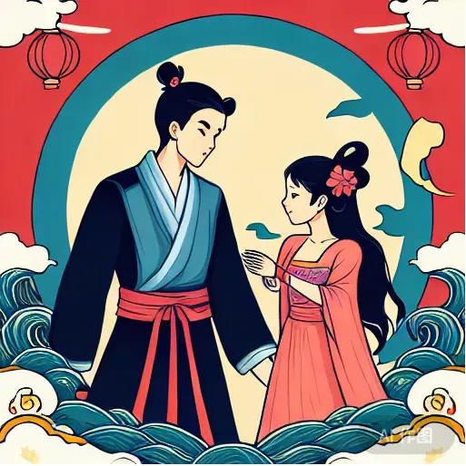

## 牛郎织女的故事

今天我跟大家分享的是牛郎织女的故事。

从前，有个忠厚善良的小伙子，名叫牛郎。他的父母去世得很早，于是他一直跟哥哥嫂嫂住在一起。

哥哥嫂嫂待牛郎非常刻薄，他们让牛郎从早到晚地干活，却只给他吃很少一点。一天，哥哥嫂嫂给了他一头老牛和一辆破车，就把他赶出了家门。

从此，牛郎便和老牛相依为命。他辛辛苦苦开垦了几块荒地种粮食，还在山坡上搭了一间草棚。

两年后，草棚换成了瓦房，粮仓里也堆满了粮食。可是，除了老牛，家里只有牛郎一个人，日子过得冷冷清清的。

有一天，老牛突然开口说话了：“牛郎，我本是天上的金牛星，因触犯天规被贬下凡。今天会有几位仙女去碧莲池洗澡，你一会儿就过去，把那件红色的仙衣藏起来，穿红仙衣的那位仙女就会成为你的妻子。”

牛郎见老牛居然说话了，又奇怪又高兴，便问道：“牛大哥，你说的是真的吗？”老牛点了点头。

于是，牛郎来到碧莲池，悄悄躲在一旁的芦苇里，等候仙女们的降临。

不一会儿，真的有几位仙女从天空飘下来，脱了衣裳，跳入池里。牛郎便从芦苇里跑出来，拿走了红色的仙衣。

仙女们见有人来了，纷纷慌乱地穿上自己的衣裳飞走了，只剩下那位没有衣服无法逃走的仙女。她正是织女。

织女是王母娘娘的外孙女，长得非常漂亮。每天，她都会和其他几位仙女一起用丝线织出美丽的云彩。

牛郎把衣服还给织女，织女穿上衣服后，牛郎走上前说：“姑娘，你能成为我的妻子吗？”织女看了看忠厚善良的牛郎，害羞地点了点头。

他们成亲以后，牛郎每天去田地里劳动，织女就在家里织布。他们相亲相爱，日子过得幸福美满。不久，他们还生下了一儿一女，孩子十分可爱。

后来，王母娘娘知道了这件事，大发雷霆，立刻派遣天神要把织女捉回天庭问罪。天神从天而降，强行带走了织女。

一对恩爱夫妻就这样被拆散了。牛郎搂着一对哭得稀里哗啦的儿女，看着越飞越高的妻子，也大哭起来。

这时，老牛又开口了：“牛郎，我就快死了。等我死后，你剥下我的皮披在身上，就可以飞上天去追织女了。”老牛说完就倒地死了。

牛郎含泪剥下牛皮，将老牛埋葬了。他又找来扁担和箩筐，将一对儿女放进箩筐里，挑着箩筐披上牛皮飞上了天。慢慢地，他们和织女之间的距离越来越近了。

眼看就快追上织女了，孩子们都急得张开双臂，大声呼叫着“娘亲”。

可就在这时，王母娘娘驾着祥云赶来了。她拔下头上的金钗一划，天空立刻出现了一条银河，把牛郎织女分开了。

织女望着银河对岸的牛郎和儿女们，哭得肝肠寸断，牛郎和孩子们也哭得死去活来。

他们的哭声是那样地催人泪下，连在一旁观望的仙女、天神们都觉得心酸难过，于心不忍。

哭声感动了人间的喜鹊。成千上万只喜鹊飞来，搭成一座坚固的鹊桥，让牛郎织女在鹊桥上相会。王母娘娘见此情形，只好允许两人在每年农历七月初七于鹊桥相会。

至今，在秋夜天空中，我们还可以看见银河两边有两颗较大的星星在闪烁，那就是织女星和牵牛星呢！

