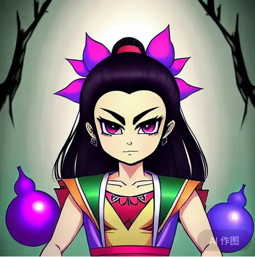

## 睡前小故事

马良用神笔画了10个太阳。

后羿去射，射破了天

女娲去补天

只剩下一个太阳

夸父去追

夸父追的累死了。

倒地化作了两座大山。

挡在了愚公家的门口。

愚公把山移走。

山下蹦出了蛇精和蝎子精。

幸亏愚公爷爷在院子里种了7个葫芦籽。

变成了7个葫芦娃。

消灭了蛇精和蝎子精。

葫芦娃也怕妖精报复。

于是全体移民海外定居。

由于身高不够。

被看成了7个小矮人。

正巧有个公主。

不知得罪了谁被追捕。

逃进了小矮人的房间。

可是还是不小心。

吃了恶毒皇后的毒苹果。

刚咬一口就昏睡过去了。

这时乔布斯在森林里散步。

由于口渴就进屋喝水。

顺手拿起了被咬一口的苹果。

仔细观摩，突发灵感。

创造了苹果手机。

最后你购买了智能手机。

看到了我们的视频。

疯狂的点击小红心和关注。